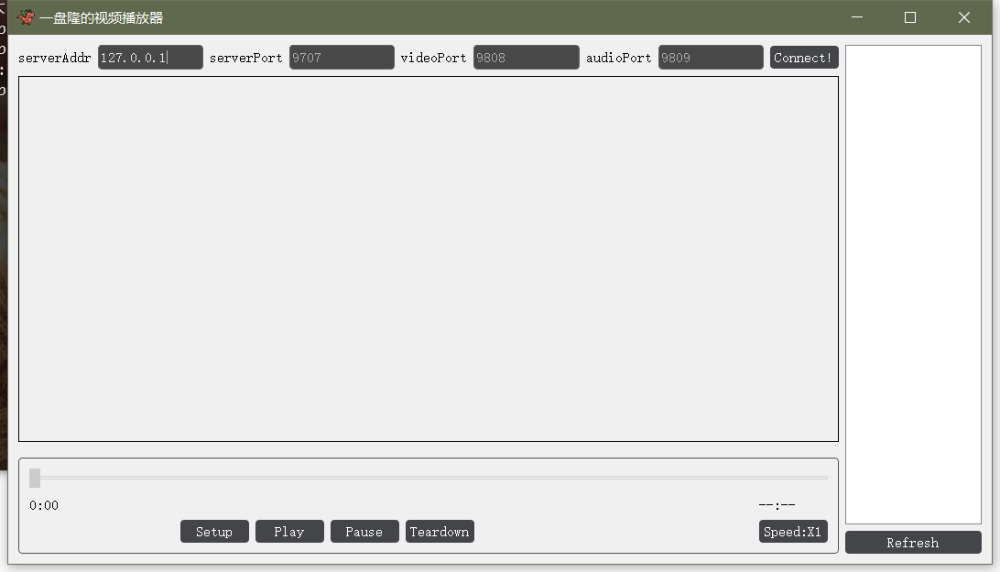

# RTP Video Player

测试环境 windows 10 + anaconda

一些包：[pyav](https://pypi.org/project/av/)解析视频 [pyaudio](https://pypi.org/project/PyAudio/)播放音频

### 1 使用方法

**Server使用**

server需要指定端口，在```./Server```目录下运行：

```
python Server.py serverHost
```

**Client使用**

Client直接打开就行，不过文件名是QClient：

```
python QClient.py
```



先设定好参数，然后点击连接。

之后依次点击setup，play

### 2 参考：

https://github.com/hamjared/CS457/tree/d9ee3823ccbde5ebcea606443a545571f1a20c4c/VideoStreamingLab

https://github.com/prakhar79/Video-Streaming-Using-RTP-RTSP/tree/88c69be2fac46cad87742ad3bd0974e42b8c3d10/Video%20Streaming%20Using%20RTSP

https://github.com/nmatthew45/471PA2/tree/b25dd3b35832e9f10ad83489d9b12e8014e528a9

pyav, pyaudio, ffmpeg官方文档

qt官方文档